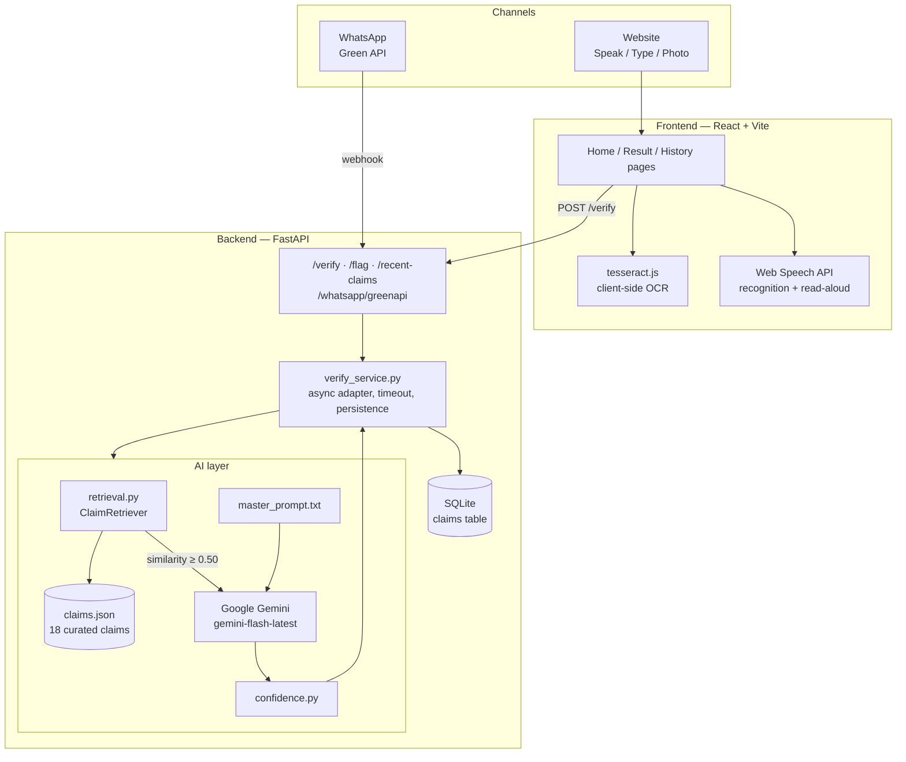
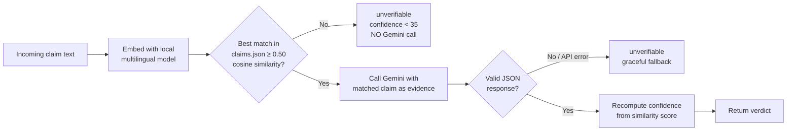

# Sat-Yukt

**सच जानें, सुरक्षित रहें** — *Know the truth, stay safe.*

A misinformation-verification system for rural and low-literacy users in India. Users can speak, type, photograph, or WhatsApp a suspicious message — a scheme, a scam, a health rumour — and get back a plain-language verdict, a confidence score, a real source, and a spoken answer, in their own language and script.

---

## Table of contents

- [What it does](#what-it-does)
- [System architecture](#system-architecture)
- [Repository layout](#repository-layout)
- [Tech stack](#tech-stack)
- [Getting started](#getting-started)
- [The mobile app](#the-mobile-app)
- [API contract](#api-contract)
- [The AI layer](#the-ai-layer)
- [Frontend feature reference](#frontend-feature-reference)
- [Backend module reference](#backend-module-reference)
- [Multilingual support](#multilingual-support)
- [Accessibility](#accessibility)
- [Known limitations](#known-limitations)

---

## What it does

| Step | What happens |
|---|---|
| 1. Share it | The user speaks into the mic, types, uploads a photo of a message, or forwards it on WhatsApp |
| 2. We check it | The claim is embedded and matched against a curated dataset of real, documented misinformation and verified government schemes |
| 3. Get a verdict | An LLM (Google Gemini) produces a **true / false / misleading / unverifiable** verdict, a confidence score, and a 2-sentence plain-language explanation grounded in that evidence — never guessed from general knowledge |
| 4. Listen or share | The verdict can be read aloud, shared, or flagged as suspicious for the community |

A judge, demo audience, or first-time user should be able to open the site, tap the mic, and understand what happened within seconds — no reading required to get started.

---

## System architecture



**The verification decision path** — this is the core safety rule of the whole system:



The LLM is **never** asked to verify a claim without matching evidence — below the similarity threshold, the system answers "unverifiable" locally, without spending an API call. This is enforced twice: once in code (a hard short-circuit) and once in the prompt itself, so it can't be defeated by a model that ignores instructions.

---

## Repository layout

This repo holds **three independently-runnable projects**, kept in separate
top-level folders so the website and the mobile app never share build tooling,
`node_modules`, or config:

```
Sat-Yukt/
├── website/                # Website (React 19 + Vite)  — see website/
│   ├── src/
│   │   ├── pages/            Home.jsx · Result.jsx · History.jsx
│   │   ├── components/       MicButton, VerdictCard, ChannelCards, etc.
│   │   ├── context/          ClaimContext · ThemeContext
│   │   ├── lib/              api.js · speech.js · ocr.js · relativeTime.js
│   │   ├── i18n/             5 locale files (en, hi, ta, te, bn)
│   │   └── styles/tokens.css Design token palette (light + dark)
│   ├── index.html · vite.config.js · package.json
│
├── mobile/                 # Mobile app (Expo / React Native + TypeScript)
│   ├── App.tsx · app.config.ts
│   ├── src/
│   │   ├── screens/          Home · History · onboarding/ · settings/
│   │   ├── components/       MicButton, VerdictCard, SchemesCard, ui/
│   │   ├── navigation/       Onboarding + Main stack navigators
│   │   ├── services/         apiClient, voiceService, twilioService, …
│   │   ├── localization/     languages.ts · strings.ts
│   │   └── theme/            fonts.ts
│   ├── backend/             Node/Express backend for the mobile app only
│   │   ├── server.js         Twilio (OTP/SMS/IVR) + STT proxy
│   │   └── services/         geminiProvider · googleSttProvider · twilio*
│   └── SETUP.md             Full mobile setup guide
│
├── backend/                # Shared verification backend (FastAPI / Python)
│   ├── main.py               App entrypoint, CORS, route registration
│   ├── routes/               verify.py · whatsapp_greenapi.py · whatsapp.py
│   ├── services/
│   │   ├── verify_service.py FastAPI-facing adapter (async, timeout, DB)
│   │   ├── ai_verify.py      AI layer orchestration
│   │   ├── retrieval.py      ClaimRetriever (embedding similarity search)
│   │   └── confidence.py     Confidence scoring from similarity
│   ├── data/
│   │   ├── claims.json       18 curated misinformation/verified claims
│   │   └── master_prompt.txt The exact LLM prompt (do not rewrite its rules)
│   └── models/               db_models.py · schemas.py
│
└── README.md                (this file)
```

**Which backend is which?** `backend/` (FastAPI) is the core claim-verification
service used by the website. `mobile/backend/` (Node) is a thin phone-facing
proxy that additionally handles Twilio OTP, SMS fallback, the voice-IVR channel,
and speech-to-text — things the website does client-side in the browser. The two
can be consolidated later; for now the mobile app is self-contained.

---

## Tech stack

### Website (`website/`)

| Layer | Technology |
|---|---|
| Framework | React 19 + Vite |
| Styling | Tailwind CSS v4, CSS custom-property design tokens |
| Routing | React Router |
| Animation | Framer Motion |
| i18n | i18next + react-i18next |
| Voice input / read-aloud | Web Speech API (`SpeechRecognition`, `speechSynthesis`) — native browser, no external service |
| Photo OCR | `tesseract.js` — runs entirely client-side, no image ever leaves the browser |
| QR codes | `qrcode.react` — generated locally, no third-party image service |
| Deploy target | Vercel |

### Mobile app (`mobile/`)

| Layer | Technology |
|---|---|
| Framework | Expo SDK 54 + React Native 0.81 + TypeScript |
| Styling | NativeWind 4 (Tailwind) |
| Navigation | React Navigation (native-stack + bottom-tabs) |
| Voice input / read-aloud | `expo-av` recording → backend STT · `expo-speech` for read-aloud |
| Local storage | `@react-native-async-storage/async-storage` |
| Fonts | Poppins via `@expo-google-fonts` |
| Mobile backend | Node + Express (`mobile/backend/`) — Twilio OTP/SMS/IVR, STT proxy |

### Shared verification backend (`backend/`)

| Layer | Technology |
|---|---|
| Framework | FastAPI (Python) |
| Database | SQLite via SQLAlchemy |
| Embeddings / retrieval | `sentence-transformers`, model `paraphrase-multilingual-MiniLM-L12-v2` — local, free, multilingual |
| LLM reasoning | Google Gemini (`gemini-flash-latest`, with fallback candidates) |
| WhatsApp channel | Green API (QR-linked WhatsApp Web session) |
| Deploy target | Render / Railway |

---

## Getting started

### Website (`website/`)

```bash
cd website
npm install
cp .env.example .env      # set VITE_API_BASE_URL to the backend's URL
npm run dev
```

If the backend is unreachable, the app still runs — failed checks show a calm inline error instead of crashing.

### Mobile app (`mobile/`)

```bash
cd mobile
npm install
cp .env.example .env             # set EXPO_PUBLIC_BACKEND_URL to your LAN IP
cd backend && npm install && cp .env.example .env   # set GEMINI_API_KEY, Twilio, etc.
npm start                        # in mobile/backend/ — starts the Node proxy
cd .. && npx expo start          # in mobile/ — opens Expo, scan the QR with Expo Go
```

Full details, Twilio/STT setup, and the voice-IVR channel are in [`mobile/SETUP.md`](mobile/SETUP.md).

### Verification backend (`backend/`)

```bash
cd backend
python -m venv venv
venv\Scripts\activate      # or: source venv/bin/activate
pip install -r requirements.txt
cp .env.example .env       # set GEMINI_API_KEY at minimum
uvicorn main:app --reload
```

On first run, the retriever downloads a local multilingual embedding model (~470MB, one-time) and embeds all 18 dataset entries in memory — no separate generation step. See `backend/README.md` for full backend setup, environment variables, and deployment notes.

---

## The mobile app

`mobile/` is a standalone **Expo / React Native** app — the same verification
experience as the website, built for phones with rural, low-literacy users in
mind: a voice-first home screen, a short onboarding flow (language → phone → OTP
→ location), a history feed, and a settings area.

It ships with its own small **Node/Express backend** at `mobile/backend/` that
the website doesn't need, because a phone can't do these in-browser:

| Concern | How the mobile backend handles it |
|---|---|
| Speech-to-text | Proxies recordings to Google Cloud STT (→ Wispr → OpenAI Whisper fallback) |
| Phone OTP on onboarding | Twilio Verify |
| "No internet? Get result by SMS" | Twilio SMS — a second SMS carries the verdict once Gemini responds |
| Voice IVR (call the number, no app needed) | Twilio `<Gather>` / `<Record>` + the same STT + Gemini pipeline |

All secrets (Gemini, Twilio, STT keys) live only in `mobile/backend/.env` and are
never bundled into the app. The client only ever reads `EXPO_PUBLIC_BACKEND_URL`.

Full setup — Twilio account, STT provider, the IVR webhook, trial-account
limits — is in [`mobile/SETUP.md`](mobile/SETUP.md).

---

## API contract

| Endpoint | Method | Request body | Response |
|---|---|---|---|
| `/verify` | POST | `{ text, language, mode }` | `{ claim_id, verdict, confidence, explanation, source_name, source_url }` |
| `/flag` | POST | `{ claim_id }` | `{ status: "ok" }` |
| `/recent-claims` | GET | — | `[{ claim_text, verdict, confidence, timestamp }]` (newest 20) |
| `/whatsapp/greenapi` | POST | Green API webhook payload | Sends the verdict back as a WhatsApp reply |

`mode` is one of `"voice" | "photo" | "type"`. `verdict` is one of `"true" | "misleading" | "false" | "unverifiable"`.

Any speech-to-text (voice) or OCR (photo) needed to produce `text` happens **client-side**, before the request is sent — the backend only ever reasons over plain text.

---

## The AI layer

| Module | Responsibility |
|---|---|
| `services/retrieval.py` (`ClaimRetriever`) | Loads `claims.json`, embeds all 18 entries once at startup with a local multilingual model. `retrieve(query)` returns `(matched_claim \| None, similarity_score)`. Below `DEFAULT_THRESHOLD` (0.50), the match is `None`. |
| `services/confidence.py` | Derives the final confidence score from raw cosine similarity — not from whatever number the LLM returns, which is discarded and recomputed. A disclosed prototype simplification, not a trained classifier. |
| `data/master_prompt.txt` | The exact system prompt. Hard rules: never state true/false without matching evidence; explanations must use plain, non-technical language; any claim involving financial action (sending money, clicking a link, sharing bank/Aadhaar/OTP details) that resolves to false/unverifiable **must** include an explicit safety instruction. |
| `services/ai_verify.py` | Orchestrates the above into `verify_claim(text, language, retriever) -> dict`. Short-circuits to a local "unverifiable" answer (no API call) when there's no matching evidence. Retries a transient Gemini 503 with backoff before falling through to the next model candidate. Never raises — always returns a safe dict. |
| `services/verify_service.py` | The FastAPI-facing adapter. Owns the `ClaimRetriever` singleton (built once at startup, never per-request), runs the AI layer's synchronous call in a thread with a hard timeout, and persists the result. |

### Curated dataset

18 real, documented claims across five categories:

| Category | Count | Verdict | Examples |
|---|---|---|---|
| `government_scheme` | 5 | true | PM-Kisan, Ayushman Bharat, Jan Dhan Yojana |
| `fake_scheme` | 5 | false | Fake free-smartphone offers, fake gold-exchange schemes |
| `fake_kyc_scam` | 3 | false | Fake bank-KYC-update links asking for OTP/account details |
| `health_misinformation` | 3 | false | Fake COVID cures, unverified home remedies presented as fact |
| `misleading_scheme` | 2 | misleading | Real schemes with exaggerated or distorted claims attached |

---

## Frontend feature reference

_Website (`website/src/`). For the mobile app's screens and services, see [`mobile/SETUP.md`](mobile/SETUP.md)._

| Component / page | Purpose |
|---|---|
| `pages/Home.jsx` | The main input screen — mic, type, and photo modes; language picker; hero + explainer sections |
| `pages/Result.jsx` | Verdict screen — color/icon-coded card, confidence bar, source, "what to do now," share/flag |
| `pages/History.jsx` | Community/recent-checks feed, pulling live from `/recent-claims` |
| `components/MicButton.jsx` | Large circular mic button with idle pulse, waveform while recording, processing state |
| `components/VerdictCard.jsx` | Verdict-colored result card; read-aloud button using `speech.js` |
| `components/ChannelCards.jsx` | WhatsApp (QR code + deep link) and phone call cards |
| `lib/speech.js` | Wraps `SpeechRecognition` (voice input) and `speechSynthesis` (read-aloud), picking the best-quality voice available per language |
| `lib/ocr.js` | Wraps `tesseract.js` for client-side photo-to-text extraction, language-aware |
| `lib/api.js` | Fetch wrappers for `/verify`, `/flag`, `/recent-claims` |

---

## Backend module reference

| Function | Signature | Notes |
|---|---|---|
| `verify_service.verify_claim` | `async (text, language, mode, db) -> VerdictResult` | Plain async function, no HTTP dependency — called identically from the website route and both WhatsApp routes |
| `ai_verify.verify_claim` | `(text, language, retriever) -> dict` | Synchronous; run in a thread pool by the adapter above |
| `retrieval.ClaimRetriever.retrieve` | `(query) -> (dict \| None, float)` | Cosine similarity search against the embedded dataset |
| `confidence.compute_confidence` | `(similarity_score, verdict) -> int` | 0–100, capped under 35 for `unverifiable` |

---

## Multilingual support

| Language | Script | Code |
|---|---|---|
| English | Latin | `en` |
| Hindi | Devanagari | `hi` |
| Tamil | Tamil | `ta` |
| Telugu | Telugu | `te` |
| Bengali | Bengali | `bn` |

The language picker always shows native scripts (हिंदी, தமிழ், etc.), never English language names. Every UI string — not just claim results — is translated across all 5 locales, including voice recognition, read-aloud, and relative timestamps (via `Intl.RelativeTimeFormat`, automatically locale-aware).

---

## Accessibility

- Voice is the primary input — a large (108px+), centered mic button, no reading required to get started
- Every verdict is understandable through icon + color alone
- Every verdict has a working read-aloud button
- Minimum 48px touch targets throughout
- Red is reserved exclusively for the `false` verdict — never used as a general UI color
- `unverifiable` uses a deliberately neutral, calm icon and color — an honest "we don't know" is never made to look as alarming as a confirmed false claim
- Respects `prefers-reduced-motion`

---

## Known limitations

- No real authentication — the mobile app's phone OTP only sets a local flag on the device, not a server session; the website has no accounts at all (intentionally out of scope)
- On the **website**, the "Call" channel is a direct `tel:` link, not an automated system. The **mobile app** has a working Twilio voice IVR (see [`mobile/SETUP.md`](mobile/SETUP.md))
- Confidence scoring is derived from embedding similarity, not a trained classifier — a disclosed prototype simplification
- SQLite is used for storage; swap for managed Postgres before relying on data persistence in production
- The curated dataset covers 18 claims — real-world coverage would need continuous expansion
